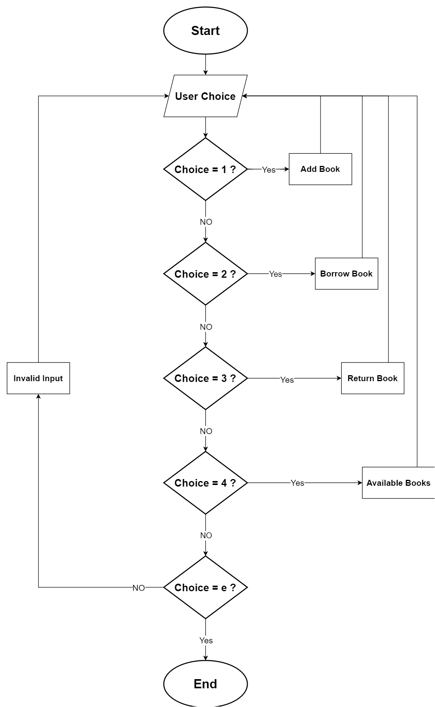

# Library Management System

This project is a Library Management System built using Python, following the Test-Driven Development (TDD) approach. The system allows you to add books, borrow books, return books, and show available books. **Additionally, in the `dev` branch, extra features have been added, such as storing and loading book data from a JSON file, updating books, and deleting books.**

## Table of Contents

1. [Test-Driven Development (TDD) and unittest](#test-driven-development-tdd-and-unittest)
2. [Activating the Virtual Environment](#activating-the-virtual-environment)
3. [Development Branch](#development-branch)
4. [Running the Project](#running-the-project)
5. [Flowcharts](#flowcharts)
6. [Test Cases Output](#test-cases-output)

## Test-Driven Development (TDD) and unittest

### What is TDD?

Test-Driven Development (TDD) is a software development approach where tests are written before the actual code. The process involves:

1. Writing a test for a specific functionality.
2. Running the test (which initially fails since the functionality is not yet implemented).
3. Writing the minimum code required to pass the test.
4. Refactoring the code while ensuring that all tests still pass.

This approach ensures that code is robust, maintainable, and bug-free, as all features are verified by tests before being considered complete.

### Why unittest?

In this project, the `unittest` framework is used to implement TDD. `unittest` is a built-in Python module that provides a wide range of tools for creating and running tests, ensuring that all aspects of the Library Management System function as expected.

## Activating the Virtual Environment

To keep the project's dependencies isolated, a virtual environment is used. Follow these steps to activate it:

### On Windows:

```bash
.\env\Scripts\activate
```

### On macOS/Linux:

```bash
source env/bin/activate
```

Once activated, you'll be able to install and use packages within this isolated environment.

## Development Branch

After implementing the core features in the `main` branch, I created a `dev` branch for further enhancements. The `dev` branch includes the following additional features:

- **Storing and Loading Book Data:** Books can be stored in and loaded from a JSON file, ensuring data persistence between sessions.
- **Update Book:** Allows modification of book details.
- **Delete Book:** Provides functionality to remove a book from the system.

These features were added to extend the basic functionalities and improve the usability of the system.

## Running the Project

### Running the Main Application:

To run the main application, use the following command:

```bash
python.exe library.py
```

### Running the Test Cases:

To run the test cases and verify the functionality of the system, use:

```bash
python.exe test_library.py
```

## Flowcharts

The following flowcharts illustrate the logic flow for both the `main` and `dev` branches:

### Main Branch Flowchart



### Dev Branch Flowchart


## Test Cases Output

Here are the outputs of the passing test cases from the `test_library.py` file:

```bash
Received JSON data in run
test_add_book (test_library.TestLibrary) ... ok
test_available_books (test_library.TestLibrary) ... ok
test_book_class (test_library.TestLibrary) ... ok
test_borrow_book (test_library.TestLibrary) ... ok
test_delete_book (test_library.TestLibrary) ... ok
test_load_data (test_library.TestLibrary) ... ok
test_read_file (test_library.TestLibrary) ... ok
test_return_book (test_library.TestLibrary) ... ok
test_update_book (test_library.TestLibrary) ... ok
test_write_data (test_library.TestLibrary) ... ok
----------------------------------------------------------------------
Ran 10 tests in 0.044s

OK
Finished running tests!
```

This output confirms that all test cases pass successfully, indicating that the implemented functionalities work as expected.

---
